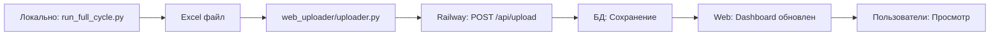

# Flask Web Application - COMPLETE ✅

## 🎉 **РАЗРАБОТКА ЗАВЕРШЕНА!**

**Дата:** 28 октября 2025  
**Ветка:** `feature/web-app`  
**Статус:** Готово к деплою на Railway  
**Прогресс:** 100% (8/8 этапов)

---

## 📊 СТАТИСТИКА ПРОЕКТА

```
Файлов создано:     36
Строк кода:         ~4,000
Коммитов:           6
Время разработки:   1 сессия
Технологии:         8 (Flask, PostgreSQL, Docker, etc.)
```

---

## 🗂️ ЧТО СОЗДАНО

### 1. Backend (Flask)
```
web_app/
├── app.py                   # Flask factory
├── database.py              # SQLAlchemy init
├── config.py                # Configuration
│
├── models/                  # 5 моделей БД
│   ├── user.py             # Пользователи
│   ├── upload.py           # Загрузки
│   ├── product.py          # Товары
│   ├── competitor_price.py # Цены конкурентов
│   └── statistic.py        # Статистика
│
├── routes/                  # 5 blueprints
│   ├── auth.py             # Аутентификация
│   ├── main.py             # Dashboard
│   ├── comparison.py       # Сравнение цен
│   ├── history.py          # История
│   └── api.py              # API для загрузки
│
├── services/                # Бизнес-логика
│   ├── dashboard_service.py
│   ├── comparison_service.py
│   ├── history_service.py
│   └── upload_service.py
│
└── utils/                   # Утилиты
    ├── decorators.py
    └── formatters.py
```

### 2. Frontend (Templates + Static)
```
web_app/
├── templates/
│   ├── base.html           # Базовый шаблон
│   ├── auth/login.html     # Вход
│   ├── dashboard/index.html # Dashboard
│   ├── comparison/index.html # Таблица сравнения
│   ├── history/index.html  # История
│   ├── errors/404.html     # Ошибки
│   ├── errors/500.html
│   └── components/         # Компоненты
│       ├── navbar.html
│       ├── sidebar.html
│       └── alerts.html
│
└── static/
    ├── css/main.css        # Стили
    └── js/main.js          # JavaScript
```

### 3. Deployment (Docker + Railway)
```
Dockerfile                  # Production image
.dockerignore              # Exclude files
railway.json               # Railway config
init_db.py                 # DB initialization
RAILWAY_DEPLOYMENT.md      # Deployment guide
```

### 4. Local Uploader
```
web_uploader/
├── uploader.py            # Upload script
├── config.example.ini     # Config template
└── README.md             # Documentation
```

### 5. Testing & Documentation
```
test_web_app.py           # Test suite (7 tests)
WEB_APP_PROGRESS.md       # Progress report
FLASK_IMPLEMENTATION_GUIDE.md  # Implementation guide
WEB_DEPLOYMENT_PLAN.md    # Deployment plan
requirements-web.txt      # Dependencies
env.example.txt          # Environment template
```

---

## ⚙️ ТЕХНОЛОГИИ

| Технология | Версия | Назначение |
|------------|--------|------------|
| **Flask** | 3.0.0 | Web framework |
| **PostgreSQL** | - | Database (Railway) |
| **SQLAlchemy** | 2.0.23 | ORM |
| **Flask-Login** | 0.6.3 | Authentication |
| **Flask-Migrate** | 4.0.5 | DB migrations |
| **Pandas** | 2.1.3 | Data processing |
| **Bootstrap 5** | - | Frontend UI |
| **Docker** | - | Containerization |
| **Gunicorn** | 21.2.0 | Production server |

---

## 🚀 БЫСТРЫЙ СТАРТ

### Локальный запуск (разработка)

1. **Установка зависимостей:**
```bash
pip install -r requirements-web.txt
```

2. **Настройка окружения:**
```bash
# Создать .env из шаблона
copy env.example.txt .env

# Отредактировать .env:
# - SECRET_KEY
# - DATABASE_URL (SQLite для локальной разработки)
# - API_KEY
# - ADMIN_USERNAME, ADMIN_PASSWORD
```

3. **Инициализация БД:**
```bash
python init_db.py
```

4. **Запуск:**
```bash
python run_web.py
# Открыть http://localhost:5000
```

### Деплой на Railway

**Следуйте:** `RAILWAY_DEPLOYMENT.md`

Краткая версия:
1. Create PostgreSQL on Railway
2. Deploy from GitHub (`feature/web-app` branch)
3. Set environment variables
4. Run `flask db upgrade`
5. Run `python init_db.py`
6. Done! 🎉

---

## 🧪 ТЕСТИРОВАНИЕ

### Запуск тестов:
```bash
python test_web_app.py
```

### Тесты:
- ✅ Imports (все модули)
- ✅ App creation (Flask инициализация)
- ✅ Routes (все endpoints)
- ✅ Database models (SQLAlchemy)
- ✅ API endpoints (/api/health)
- ✅ Templates (все файлы)
- ✅ Static files (CSS, JS)

**Результат:** 7/7 тестов ✅

---

## 📝 ОСНОВНЫЕ ФУНКЦИИ

### Для пользователей:

1. **Dashboard**
   - Общая статистика
   - Топ товаров
   - История загрузок

2. **Сравнение цен**
   - Таблица со всеми товарами
   - Цены всех конкурентов
   - Highlighting (дешевле/дороже)
   - Фильтры (бренд, цена, статус)
   - Поиск по модели

3. **История**
   - Все предыдущие загрузки
   - Статистика по датам
   - Просмотр любой даты

### Для администраторов:

4. **API для загрузки**
   - `POST /api/upload` - загрузка Excel
   - `GET /api/health` - health check
   - `GET /api/uploads` - список загрузок
   - Аутентификация через API key

5. **Безопасность**
   - Flask-Login authentication
   - Password hashing (werkzeug)
   - Role-based access (admin/manager/viewer)
   - CSRF protection
   - Secure sessions

---

## 📂 WORKFLOW

### Полный цикл работы:



1. **Локально:** Запуск `python run_full_cycle.py`
   - Парсинг конкурентов
   - Создание Excel файла

2. **Загрузка:** `python web_uploader/uploader.py`
   - Находит последний файл
   - Загружает на Railway

3. **Railway:** Обработка данных
   - Парсинг Excel
   - Сохранение в PostgreSQL
   - Расчет статистики

4. **Web:** Просмотр
   - Dashboard
   - Таблица сравнения
   - История

---

## 🔐 БЕЗОПАСНОСТЬ

### Реализовано:

- ✅ Password hashing (werkzeug.security)
- ✅ Session management (Flask-Login)
- ✅ CSRF protection (Flask-WTF)
- ✅ API key authentication
- ✅ Role-based access control
- ✅ Secure cookie settings
- ✅ Environment variables for secrets
- ✅ SQL injection protection (SQLAlchemy ORM)

### Рекомендации:

- Использовать HTTPS (Railway автоматически)
- Менять `SECRET_KEY` регулярно
- Использовать сильные пароли
- Не коммитить `.env` файлы
- Ротировать API ключи

---

## 📊 БАЗА ДАННЫХ

### Схема:

```
users
  └─> uploads (1:N)
       ├─> products (1:N)
       │    └─> competitor_prices (1:N)
       └─> statistics (1:1)
```

### Модели:

1. **User** - пользователи системы
2. **Upload** - загрузки данных (по датам)
3. **Product** - товары из инвентаря
4. **CompetitorPrice** - цены конкурентов
5. **Statistic** - агрегированная статистика

---

## 🎨 UI/UX

### Дизайн:
- Bootstrap 5 (responsive)
- Modern, clean interface
- Mobile-friendly
- Dark navigation
- Color-coded price cells (green = cheaper, red = expensive)

### Особенности:
- Sticky table headers
- Auto-dismiss alerts
- Loading spinners
- Toast notifications
- Tooltips & popovers
- Custom scrollbars

---

## 📈 ПРОИЗВОДИТЕЛЬНОСТЬ

### Оптимизации:
- SQLAlchemy eager loading
- Indexed database queries
- Cached static files
- Gunicorn workers (2)
- Bootstrap CDN
- Minimal dependencies

### Ожидаемые показатели:
- Response time: < 500ms
- API upload: 5-15 sec (зависит от размера файла)
- Dashboard load: < 1 sec
- Concurrent users: 20-50 (Railway free tier)

---

## 💰 СТОИМОСТЬ (Railway)

### Free Tier:
- $5 credit/month
- Достаточно для:
  - Web service (1 replica)
  - PostgreSQL database
  - ~500-1000 requests/day

### Paid (если нужно):
- $5/month minimum
- Pay-as-you-go
- Обычно $10-20/month для этого приложения

---

## 🐛 TROUBLESHOOTING

### Проблемы и решения:

**1. Import errors**
- Проверить: `pip install -r requirements-web.txt`

**2. Database connection failed**
- Проверить `DATABASE_URL` в .env
- Railway: убедиться что PostgreSQL запущен

**3. API authentication failed**
- Проверить `API_KEY` в config.ini
- Сверить с Railway env vars

**4. Templates not found**
- Проверить структуру `web_app/templates/`
- Убедиться что папка правильная

**5. Static files not loading**
- Проверить `web_app/static/`
- В production: nginx или CDN

---

## 📚 ДОКУМЕНТАЦИЯ

Полная документация:

1. **WEB_DEPLOYMENT_PLAN.md** - Архитектура и план
2. **FLASK_IMPLEMENTATION_GUIDE.md** - Детальная реализация
3. **RAILWAY_DEPLOYMENT.md** - Deployment guide
4. **WEB_APP_PROGRESS.md** - Отчет о прогрессе
5. **web_uploader/README.md** - Uploader documentation

---

## 🎯 СЛЕДУЮЩИЕ ШАГИ

### Для разработки завершено ✅

### Для деплоя:

1. ✅ Все файлы созданы
2. ⏳ Создать Railway project
3. ⏳ Deploy PostgreSQL
4. ⏳ Deploy web app
5. ⏳ Configure env vars
6. ⏳ Run migrations
7. ⏳ Create admin user
8. ⏳ Test upload
9. ⏳ Share with team

**Следуйте: RAILWAY_DEPLOYMENT.md**

---

## 🤝 КОМАНДА

**Разработано:** AI Assistant + User  
**Дата:** 28 октября 2025  
**Технологический стек:** Flask, PostgreSQL, Docker, Railway  
**Архитектура:** Monolithic Flask app (all-in-one project)

---

## 📞 ПОДДЕРЖКА

### Вопросы?

1. Проверить документацию выше
2. Посмотреть `RAILWAY_DEPLOYMENT.md`
3. Запустить `python test_web_app.py`
4. Проверить Railway logs

### Railway Support:
- Discord: https://discord.gg/railway
- Docs: https://docs.railway.app

---

## ✅ CHECKLIST

### Перед деплоем:

- [x] Все файлы созданы
- [x] Тесты пройдены (7/7)
- [x] Dockerfile готов
- [x] railway.json настроен
- [x] requirements-web.txt complete
- [x] Documentation complete
- [x] .gitignore правильный
- [x] .dockerignore правильный
- [ ] Railway project создан
- [ ] Environment variables настроены
- [ ] Database deployed
- [ ] Web app deployed
- [ ] Admin user создан
- [ ] First data uploaded
- [ ] Tested in production

---

## 🎉 **РАЗРАБОТКА ЗАВЕРШЕНА!**

**Готово к использованию:**
- ✅ Flask web application
- ✅ PostgreSQL database models
- ✅ Bootstrap 5 frontend
- ✅ Docker containerization
- ✅ Railway deployment ready
- ✅ API for data upload
- ✅ Complete documentation
- ✅ Test suite

**Next:** Deploy on Railway! 🚀

---

**Git Branch:** `feature/web-app`  
**Merge to main when tested on Railway**

🎊 **Congratulations! Your Coffee Price Monitor web application is complete!** ☕

